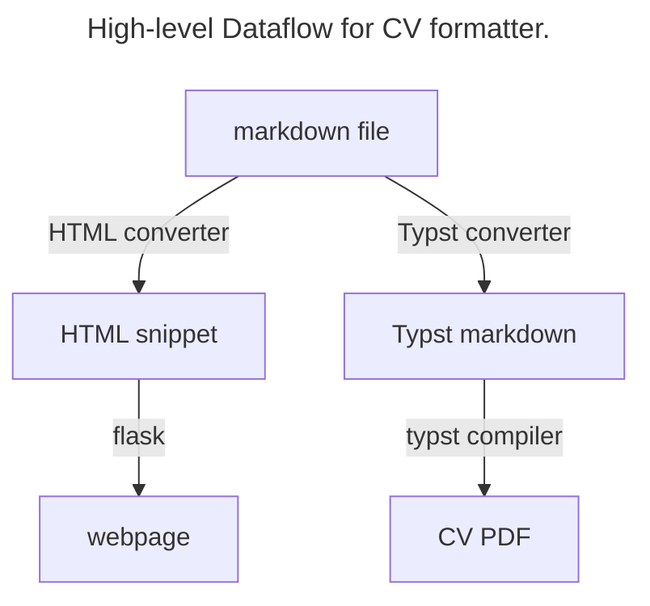

# CV Formatter

This repository contains my CV Formatter and my CV!

If you have ever needed to keep multiple versions of your CV up to date, you might know that it's a hassle. If you make a change to the CV document that you send to recruiters, it's easy to forget to make that change to the CV that's displayed on your webpage. This CV Compiler is designed to change that, allowing for easy writing and editing using a simple Markdown file, but rich and flexible formatting for the web and PDF.

## Requirements:

To run this, you'll need Python 3.8 or newer, the re Python library, Pandoc and the Typst compiler installed. 

### Using this with your own CV:

You'll need to copy the entire repository and install all requirements. Once this is done, call `python3 convert.py` and your code will run! This will generate an HTML snippet and a Typst markdown file (at the moment, just a Typst markdown file, HTML conversion is coming soon!). To compile the Typst file, just run `typst compile <FILENAME>. This will convert your typst file to a PDF.
