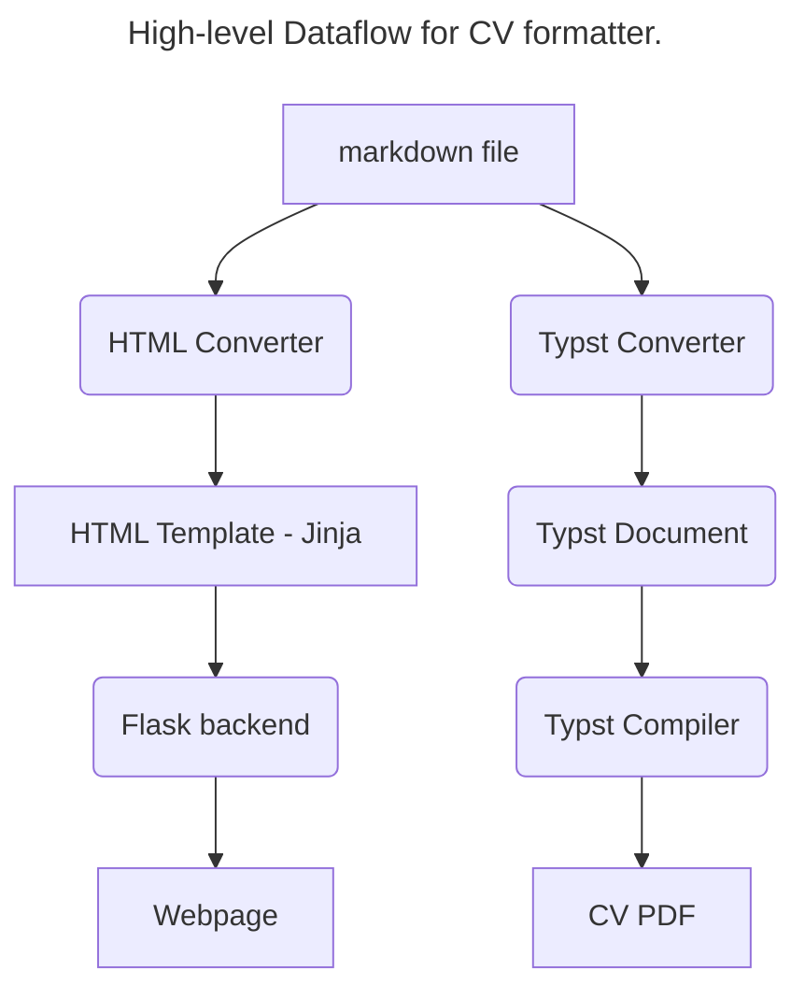

# CV Formatter

This repository contains my CV Formatter and my CV!

If you want to read my CV, please visit `cv_copy.md`. This file contains the markdown file for my CV. It is a general, up-to-date CV (I use it to generate any CV I send off, with minor changes to tailor it to specific job roles).

if you want to read more about how I generate a PDF CV from a markdown document, read on from here:

If you have ever needed to keep multiple versions of your CV up to date, you might know that it's a hassle. If you make a change to the CV document that you send to recruiters, it's easy to forget to make that change to the CV that's displayed on your webpage. This CV Compiler is designed to solve that problem, allowing for easy writing and editing using a simple Markdown file, but rich and flexible formatting for the web and PDF.

It's also designed to let me concentrate on writing a CV instead of formatting it by completely separating the writing and formatting tasks. It allows me to host my CV on GitHub in a Markdown document.

## Requirements:

To run this, you'll need Python 3.8 or newer, the [`re`](https://docs.python.org/3/library/re.html) Python library (which handles regular expressions), [Pandoc](https://pandoc.org/), and the [Typst](https://typst.app/) compiler installed. 

## Using this with your own CV:
Currently, this isn't easy to use with your CV. I'm working on changing this, but it's not a high-priority item (I have to apply for jobs, and my details don't change much).
If you want to use it anyway, go ahead! You can change the personal details included in the  `typst_files/header.typ` section of this document (the address field is the most obvious thing to change), and use the `cv_copy.md` file to change the copy of your CV.

Once you are done editing, you can compile, make sure you have installed all the requirements you need, and then run `python3 convert.py`. This will convert the document, compile a PDF and save it to `cv.pdf`. If you want to save this file somewhere else (like your documents folder for example) then change the variable `OUTPUT_PDF_LOC` in `convert.py`.

## TODO:
+ Create a HTML converter that will seamelessly convert the markdown to a HTML template.
+ Create a header parser that will process the header section of the CV so it displays correctly on Typst.
+ Create a shell script/CLI that can take an input file and then write it to an output file.
+ Create/send a call to a CV checker that checks for common CV issues.
 

